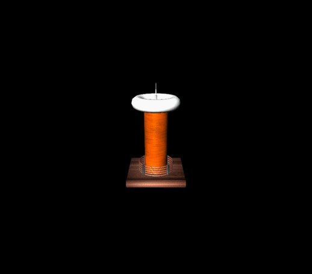
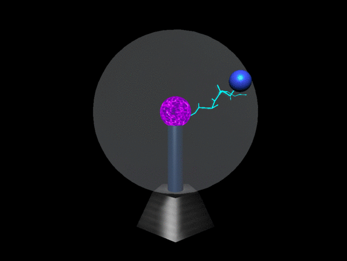
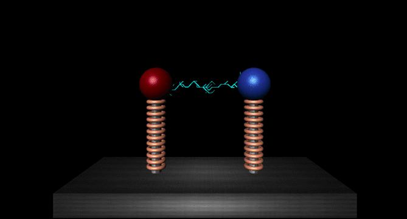
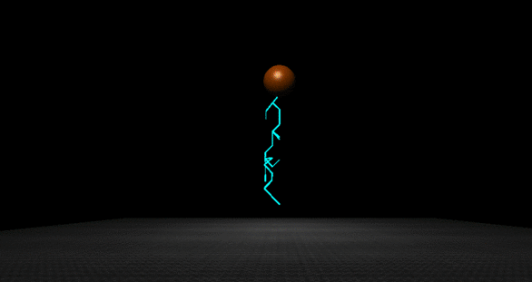
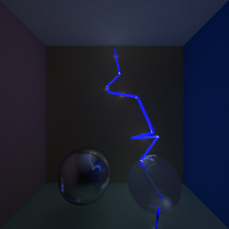

# Rendering Lightning

## Project Group:
* Manas Shukla 170050066
* Debabrata Mandal 170050073


## Requirements:
For running threejs application:
* The project needs a server application runnning.
* Either of the two packages will suffice:
    * [**node** and **npm**](https://nodejs.org/en/download/) : This will use webpack server. 
    * [**python 3**](https://www.python.org/downloads/): This will use python http server.

For running ray tracing application:
* **Eigen** library of c++
* Common tools(**g++,make**) for compiling c++ code.


## [ Rasterization framework ]


## Instructions For Running the code ##


* ### Using Webpack Server(**Recommended**) ###
    ```bash
    cd code
    # install packages
    npm i
    # start webpack dev server
    npm start
    # note any changes in code will now directly be updated in browser
    ```
    > Then go to http://localhost:8080/

* ### Using Python Http Server ###
    ```bash
    cd code
    python3 -m http.server 
    ```
    > Then go to http://localhost:8000/dist/


## Models ##
There are four Model Currently we render:
* ### **Tesla Coil** ###
    * 
    * **ElectroStaticSystem** is used to generate arcs. The top of needle has high charge density from where electric discharge occurs.
    * The system uses potential function of negative point charge placed in a sphere of positive charge.

* ### **Plasma Ball** ###
    * 
    * **PlasmaBallSystem** is used to generate arcs. Small Blue sphere is the target for arcs. **You can hover over glass sphere to change the target**. Ray Casting has been used to calculate point on glass sphere.
    * The system uses potential function of negative point charge(center ball) placed in a surrounding of a strong positive charge(blue ball)

* ### **Electrodes** ### 
    * 
    * **ElectrodeSystem** is used to generate arcs. We have implemented **Paper in Reference 3** to generate arcs between red and blue electrode.
    * **Note that arcs are generated from both the electrodes**. The difference can be seen more clearly in actual output.
    * The system uses potential function of two opposite charge placed at a distance d apart. 

* ### **Lightning Strike** ####
    * 
    * **StormCloudSystem** is used to generate arcs. In this bottom we have a charged plane. And top we have a charged sphere. Arcs are generated from sphere to any point in the plane.
    * The system uses potential function of negative point charge placed near a plane with negative charge density. 

<br/>

## [ Ray Tracing framework ]


## Instructions For Running the code ##

```bash
cd rt
# compile code
make
# run the cornellscene2.xml file(takes some time to complete)
./rt ./scenes/cornellscene2.xml
```
> Then go to scenes folder, there you can find cornellscene2.ppm image created.


## Models ##
For Ray tracing we have done stochastic model for generating arcs.

* 
* **stochastic_t** class implements the stochastic process of generating arcs structure.
* **cylinder_t** represents object for representing cylinder.(every arc object can be modelled as a cylinder).
* **cylinder_light_t** represents cylinder light source. This will be used to light up the scene(every arc is a cylinderical light source)

<br/>


## References
1. [**Main Paper**](http://gamma.cs.unc.edu/LIGHTNING/lightning.pdf)
2. [**Optimization Reference**](http://gamma.cs.unc.edu/FRAC/laplacian_large.pdf)
3. [**Electrode Simulation**](https://www.researchgate.net/publication/236619131_Fractal_Nature_of_Simulated_Lightning_Channels)
4. [**ThreeJs Framework**](https://threejs.org/)
5. [**ThreeJs Fundamentals**](https://threejsfundamentals.org/)
6. [**GIF Maker**](https://ezgif.com/maker)
7. [**Sound Credits**](https://www.youtube.com/watch?v=xMooLcAqiXg)
8. [**Stochastic Method**](https://www.researchgate.net/publication/224347603_Mathematical_Model_of_Lightning_Stroke_Development)
9. [**Ray Cylinder Intersection**](https://www.doc.ic.ac.uk/~dfg/graphics/graphics2009/GraphicsLecture11.pdf)

---
Presentation Link : https://docs.google.com/presentation/d/1b6mn2sxPl3TzdRBLEK1IDcx9OKzhVzAHQ8gxjFgVZhM/edit?usp=sharing